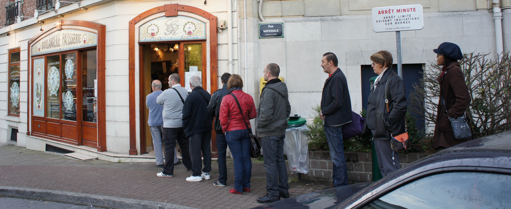
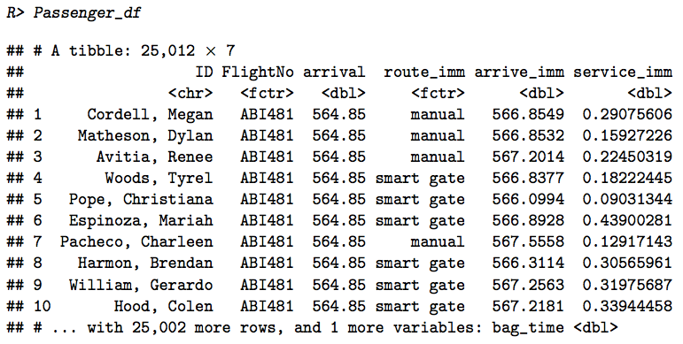

```{r setup, include=FALSE}
knitr::opts_chunk$set(echo = TRUE)
```

# Simulation efficace des files d'attente complexe avec le paquet R "queuecomputer"

```{r fig.width=2, fig.height=50,echo=FALSE, out.width="200px"}
 

set.seed(1)
``` 

# La file d'attente à une boulangerie

```{r bakery, out.width="300px", echo=FALSE}

```

# Simple example (input)

```{r example, size = "small", message=FALSE}
library(queuecomputer)
library(dplyr)

n_customers <- 40
arrivals <- rexp(n_customers, 3.1) %>% cumsum()
service <- rexp(n_customers, 1)

n_servers <- 3
departures <- queue_step(arrivals, service, n_servers)

#n_servers <- as.server.stepfun(10, c(2,4))
```


# Simple example (output)

```{r example2, message = FALSE}

head(arrivals, 3)
head(service, 3)
head(departures$departures, 3)

```

# Summary

```{r summary}
summary(departures)
```

# Plot of number of customers in queue

```{r, message=FALSE, quietly = TRUE, results='hide'}
plot(departures, which = 4)
```

# Plot of customer status

```{r, message=FALSE, quietly = TRUE, results='hide'}
plot(departures, which = 5)
```

# Empirical distribution of arrival and departure times
```{r, message=FALSE, quietly = TRUE,results='hide'}
plot(departures, which = 6)
```

# Temps de calcul / Computation time

```{r, out.width="300px", echo=FALSE}
knitr::include_graphics("figure/benchmark.pdf")
```

# Airport terminal

```{r, out.width="300px", echo=FALSE}

```

# Airport terminal

```{r airport terminal, include = FALSE}
library(magrittr)
library(randomNames)
library(FAdist)
library(ggplot2)
library(tidyr)

set.seed(1)


# Functions --------------------

RandomFlightNumbers <- function(n){
  working_df <- data.frame(
    First_Letter = sample(LETTERS, n, replace = TRUE),
    Second_Letter = sample(LETTERS, n, replace = TRUE),
    Third_Letter = sample(LETTERS, n, replace = TRUE),
    First_Number = sample(c(1:9), n, replace = TRUE),
    Second_Number = sample(c(1:9), n, replace = TRUE), 
    Third_Number = sample(c(1:9), n, replace = TRUE)
  )
  
  output <- working_df %>% transmute(FlightNo = paste(
    First_Letter, Second_Letter, Third_Letter, First_Number, 
    Second_Number, Third_Number, sep = ""
  ))
  
  output$Passengers = rbinom(n, size = 260, prob = 0.8)
  output$arrival = round(rbeta(n, 2, 4) * 960 + 360, 2)
  output %<>% mutate(chocks = 
      queue(arrival, service = rep(35, n), servers = 12, serveroutput = TRUE) - 30, 
    gate = attr(chocks, "server")
  )
  
  output$type = sample(letters[1:2], n, replace = TRUE, prob = c(0.4, 0.6))
  
  
  return(output)
}

PassengerExpand <- function(input){
  output <- data.frame(
    ID = randomNames(input$Passengers),
    FlightNo = as.factor(rep(input$FlightNo, input$Passengers)),
    arrival = rep(input$chocks, input$Passengers),
    type = rep(input$type, input$Passengers),
    route_imm = sample(c("smart gate", "manual"), prob = c(input$r_prob, 1 - input$r_prob), replace = TRUE, size = input$Passengers),
    distance = rep(input$distance, input$Passengers), 
    bag_rate = rep(bag_rate, input$Passengers)
  )
  
  return(output)
}

# Paramaterised Data --------------------------------------

bag_rate = 10

gate_df <- data.frame(
  gate = c(1:15), 
  distance = c(rep(20,10), rep(20.1,5))
)

routing_df <- data.frame(
  type = c("a", "b"),
  r_prob = c(0.5, 0.5)
)

parameter_df <- data.frame(
  type = c("a", "b", "a", "b"), 
  route_imm = c("smart gate", "smart gate", "manual", "manual"),
  walking_shape = c(0.1, 0.1, 0.1, 0.1),
  service_imm = c(6, 6, 2.5, 2.5)
)

## Build Flight Schedule ----------------------

FlightSchedule <- RandomFlightNumbers(120) %>%
  left_join(gate_df) %>%
  left_join(routing_df) %>%
  group_by(FlightNo)

if(
  (FlightSchedule %>% group_by(FlightNo) %>% 
      summarise(numberp = n()) %>% 
      dim())[1] != 120
){
  warning("Duplicate flight numbers detected")
}

FlightSchedule %<>% group_by(FlightNo)

# Passenger Data --------------------

Passenger_df <- FlightSchedule %>% 
  do(PassengerExpand(.)) %>%
  left_join(parameter_df) %>%
  group_by(type, route_imm) %>%
  mutate(arrive_imm = rllog(n(), shape = walking_shape[1], scale = log(distance[1]/10)) + arrival) %>%
  group_by(FlightNo) %>%
  mutate(bag_time = cumsum(rexp(n(), rate = bag_rate)) + arrival + 9) %>%
  group_by(type, route_imm) %>%
  mutate(service_imm = rexp(n(), service_imm[1])) %>%
  ungroup() %>%
  select(ID, FlightNo, arrival, 
    route_imm, arrive_imm, service_imm, bag_time)

Passenger_df$FlightNo <- as.factor(Passenger_df$FlightNo)


##%%% Can show this on JSS paper

Passenger_df


server_df <- data_frame(
  route_imm = c("smart gate", "manual")
)

server_df$servers <- list(5, as.server.stepfun(x = c(600,780), y = c(10,12,8)))

```

```{r, show1}
server_df
```

```{r, eval = FALSE}
Passenger_df %>% 
  left_join(server_df) %>% 
  group_by(route_imm) %>%
  mutate(
    departures = queue(
      arrive_imm, service_imm, servers[[1]])
    ) 
```

# Merci!

```{r, echo = FALSE}
finish_presentation <- function(){"Merci!"}
```

```{r}
finish_presentation()
```


